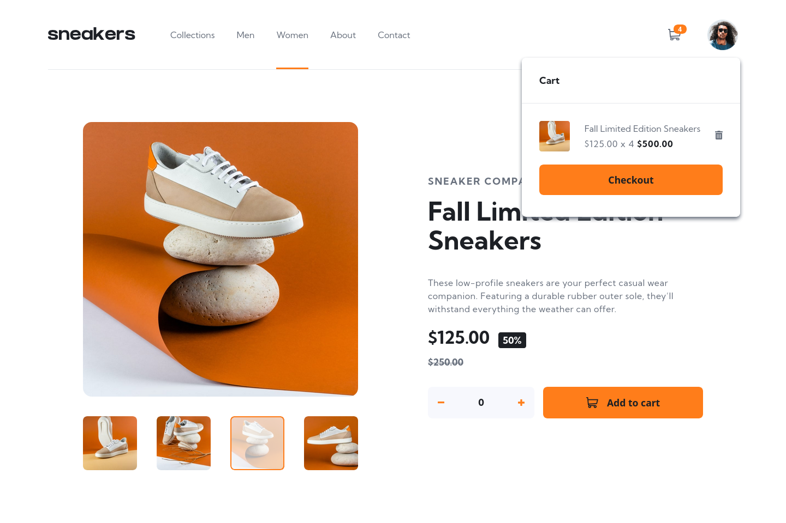
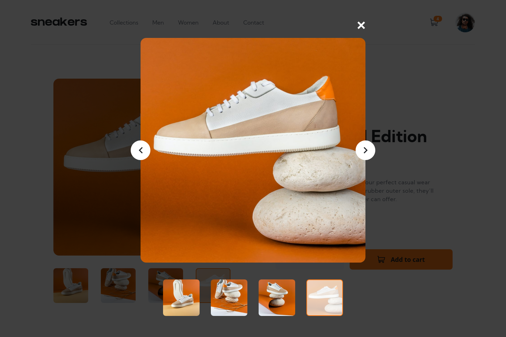
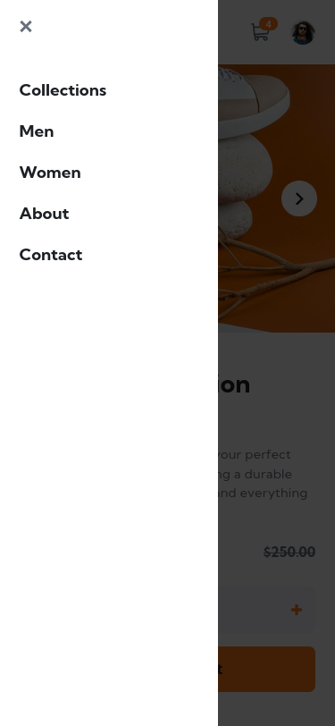
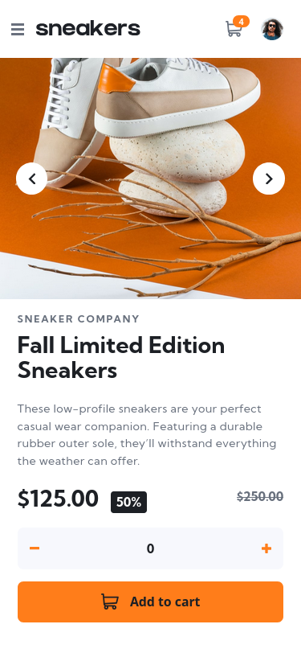

# Frontend Mentor - E-commerce product page solution

This is a solution to the [E-commerce product page challenge on Frontend Mentor](https://www.frontendmentor.io/challenges/ecommerce-product-page-UPsZ9MJp6).

## Overview

### The challenge

Users should be able to:

- View the optimal layout for the site depending on their device's screen size
- See hover states for all interactive elements on the page
- Open a lightbox gallery by clicking on the large product image
- Switch the large product image by clicking on the small thumbnail images
- Add items to the cart
- View the cart and remove items from it

### Screenshots

<table width="100%">
  <tr>
    <td width="33%" align="center"></td>
    <td width="34%" align="center"></td>
    <td width="33%" align="center"></td>
  </tr>
</table>

### Links

- [Solution URL](https://www.frontendmentor.io/solutions/responsive-e-commerce-product-page-roGw-fp9T-)
- [Live Site URL](https://nik-i-net.github.io/ecommerce-product-page/)
